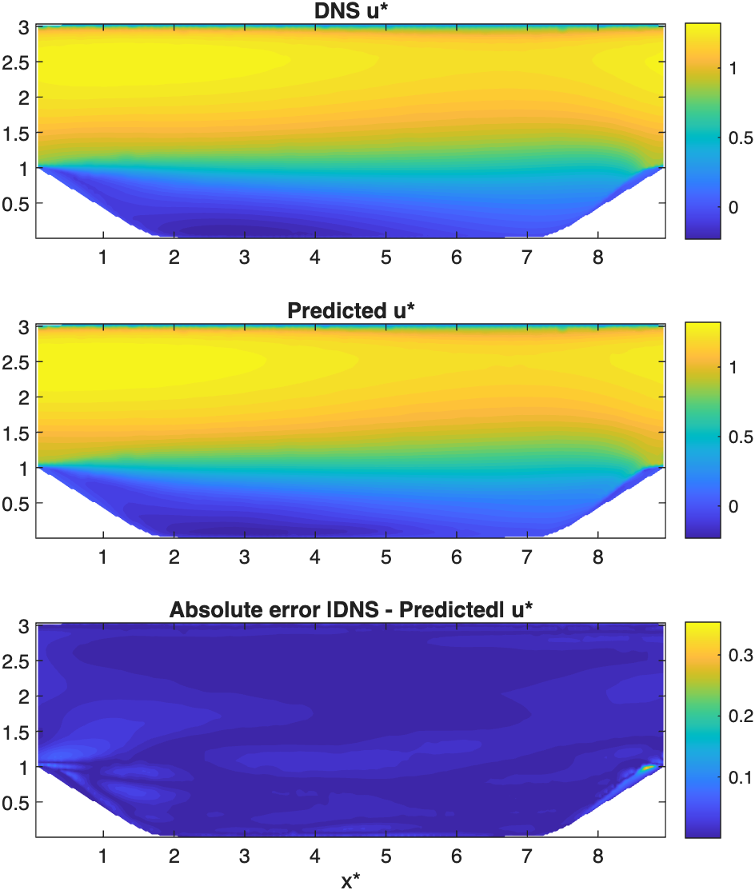
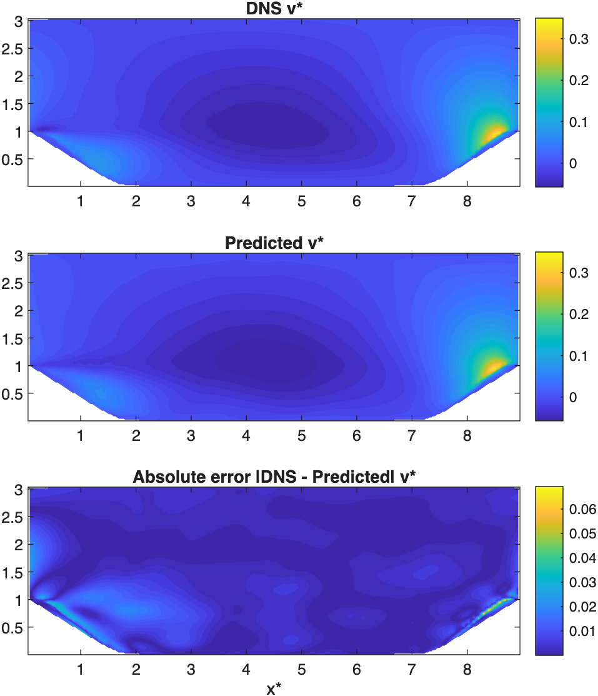
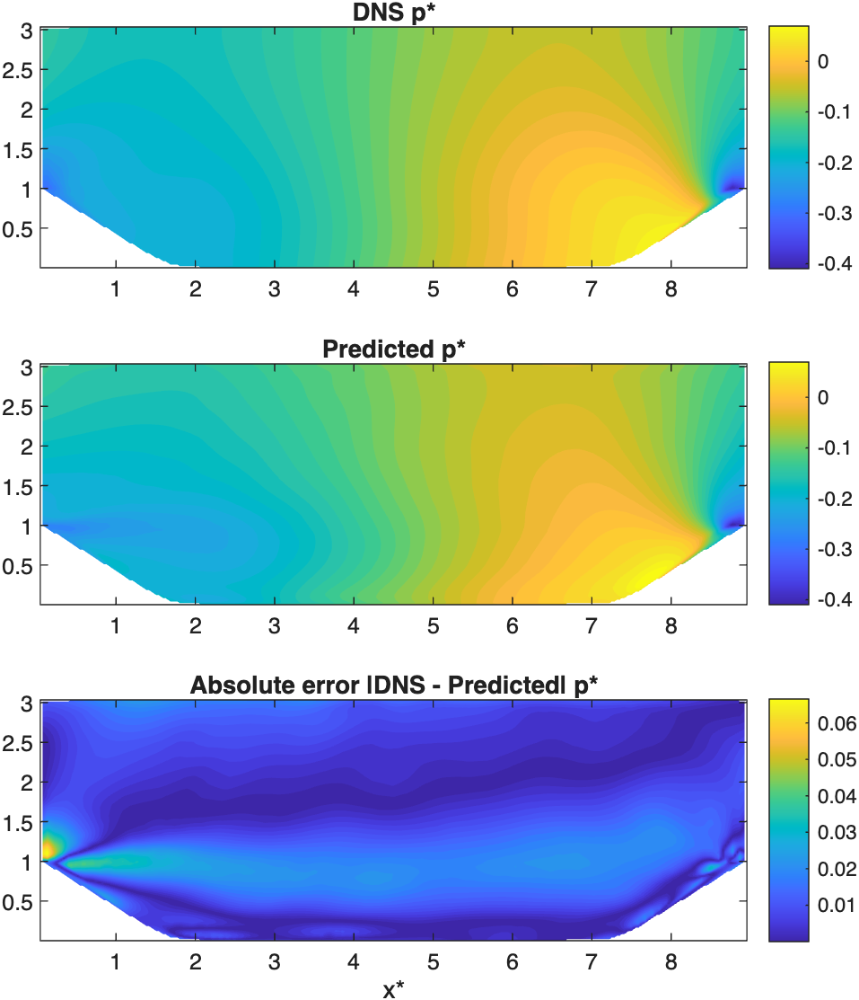
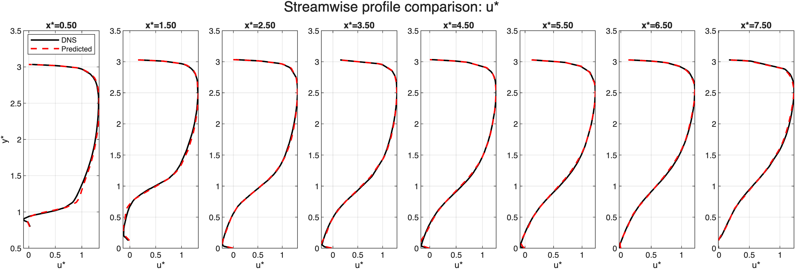
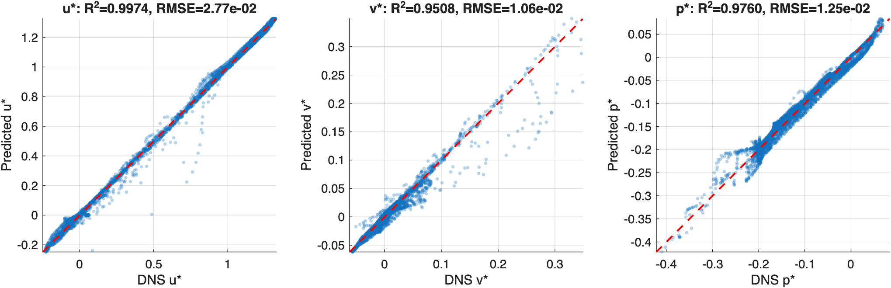

# Physics-Informed Neural Network for Fluid Flow Simulation

This project implements a Physics-Informed Neural Network (PINN) in MATLAB to model 
flows over periodic hills [2], using the Reynolds-Averaged Navier–Stokes (RANS) equations as the governing physics. 
Rather than learning purely from data, the network is also trained to satisfy the underlying physics, allowing it 
to generalise better with limited or noisy training data.

## Overview

- **Goal:** The goal of this project is to develop a PINN capable of predicting the flow 
            over a periodic hill without relying solely on labeled data. By incorporating 
            the RANS equations directly into the loss function, the network is constrained 
            toward physically consistent solutions, reducing dependence on large training 
            datasets and discouraging trivial, low-variance predictions (e.g. a near-constant 
            output that could minimise data loss without representing genuine flow physics).
- **Governing equations:** 2D steady incompressible RANS
- **Domain / geometry:**  Periodic hills of parameterised geometries [2]
- **Outputs predicted:** velocity field (u, v), pressure (p)

## Project Structure

| File | Description |
|---|---|
| `PHLL_PINN.m` | Main script - Loads training data, initialises the neural network and trains the PINN |
| `modelLoss.m` | Overall model loss function called within PHLL.m |
| `wallLoss.m` | Wall Boundary Layer loss function called within modelLoss.m |
| `dataLoss.m` | DNS data loss function called within modelLoss.m |
| `physicsResidualLoss.m` | Physics-informed loss function called within modelLoss.m |
| `fourierFeatures.m` | Used to map the input coordinates into high frequency signals to minimise spectral bias [1] |
| `fcRWFLayer.m` | Custom neural network layer that incorporates random weight factorisations (RWF) to improve performance [1] |
| `buildNetwork.m` | Function to build the neural network using given hyperparameters |
| `plotModelVsData.m` | Ploting script comparing PINN vs validation dataset to produce the figures given below |
| `rowRescaleFunc.m` | Function to reorganise the data into 1 × N row vectors for use with minibatchqueue |
| `loadData.m` | Function to load only the required fields from the data in Raw_Data |
| `continuityResidual.m` | Function to calculate the relative residual after training for validation of the model |
| `trainedPINN.mat` | Given trained PINN from which the data presented below is extracted from using plotModelVsData.m |
| `PINN_Figures` | Folder containing .png and .fig versions of the figures seen below. PHLL_PINN.m stores the training loss figure and plotModelvsData.m stores the comparison plots here |
| `Raw_Data` | Folder contains only the raw data for the cases used in training, to save memory |

## How to Run

1. Clone or download this repository.
2. Open MATLAB (tested on R2025a; requires the Deep Learning Toolbox).
3. Run the training script:
   ```matlab
   PHLL_PINN.m
   ```
   This trains the network and saves the result to `trainedPINN.mat`.
4. Run the visualisation/evaluation script:
   ```matlab
   plotModelVsData.m
   ```
   Note: `trainedPINN.mat` contains a fully trained model ready to run `plotModelVsData.m`

   This loads the trained model and generates the comparison plots shown below. The figures are stored in PINN_Figures as .png and .fig files.

## Methodology

The physics model is embedded in the PINN training as a loss function, which comprises three terms: 
the physics residual, the data residual (against the RANS data), and the residual of the enforced 
wall boundary condition. The DNS Reynolds stresses were interpolated to compute the spatial derivatives 
required by the physics residual, while automatic differentiation was used to compute the velocity and 
pressure derivatives.

Training began with the Adam optimiser, which was terminated when either the relative residual had 
improved by less than 5% compared with its value 49 epochs earlier, or 500 epochs had been completed. 
In practice, the first condition was met at approximately 150 epochs. The Adam optimiser met the break 
condition at a relative residual of ~23% before training transitioned to the L-BFGS 
optimiser. As with the Adam optimiser, a break condition was enforced - the training was stopped 
if the improvement was less than 1% over 49 iterations, or after a maximum of 3000 iterations. In practice, 
the break condition was met after 1500 L-BFGS iterations. Random weight factorisation and 
Fourier feature mapping [1] were also used to enhance model performance.

## Results

**Predicted vs. True $u^*$ Velocity Field**




**Predicted vs. True $v^*$ Velocity Field**




**Predicted vs. True $p^*$ Pressure Distribution**




**Predicted vs. True $u^*$ Streamwise Distribution**




**Predicted vs. True Error Plots**



**Relative Residual Error**

Relative residual error = 3.28 %

## Comparison

The total training time of the PINN was 30 minutes and 1.02 seconds on a machine with an 
AMD Ryzen 5 3600X CPU, an NVIDIA RTX 2060 Super GPU, and 16 GB of 3200 MHz RAM. This is a 
substantial saving compared with DNS. A DNS on a coarser mesh (512 × 257 × 128 rather 
than 768 × 385 × 128) cost approximately 25,000 core-hours [4], whereas the RANS simulations 
took "of the order of a couple of hours on a powerful workstation" [4]. Given R² values above 
0.95 for all three predicted outputs, the PINN represents a potential low-cost approach to 
turbulence modelling.

## Requirements

- MATLAB R2025a
- Deep Learning Toolbox

## Acknowledgments

Submitted as part of the MATLAB & Simulink Challenge Project Hub project:
*Fluid Flow Simulation Using Physics-Informed Neural Networks*. <br>
Available: https://github.com/mathworks/MATLAB-Simulink-Challenge-Project-Hub/tree/main/projects/Fluid%20Flow%20Simulation%20Using%20Physics-Informed%20Neural%20Networks

[1] S. Wang, S. Sankaran, H. Wang, and P. Perdikaris, <br> 
"An Expert's Guide to Training Physics-Informed Neural Networks," [Online]. <br>
Available: https://arxiv.org/abs/2308.08468

[2] H. Xiao, J.-L. Wu, S. Laizet, and L. Duan, <br>
"Flows over periodic hills of parameterized geometries: A dataset for data-driven turbulence modeling from direct simulations," 
Computers & Fluids, vol. 200, 2020. <br>
doi: 10.1016/j.compfluid.2020.104431

[3] R. McConkey, "Turbulence Modelling Using Machine Learning" <br>
[Dataset], Kaggle, version 3. [Online]. <br>
Available: https://www.kaggle.com/datasets/ryleymcconkey/ml-turbulence-dataset

[4] Voet, L. J. A., Ahlfeld, R., Gaymann, A., Laizet, S., & Montomoli, F. (2021). <br>
A hybrid approach combining DNS and RANS simulations to quantify uncertainties in turbulence modelling. <br>
Applied Mathematical Modelling, 89 (Part 1), 885–906. <br>
doi: 10.1016/j.apm.2020.07.056

